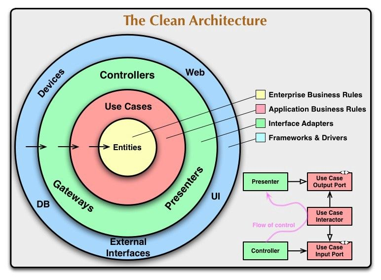

# Clean Architecture

## 1. Định nghĩa

**Clean Architecture** là mô hình kiến trúc phần mềm được đề xuất bởi **Robert C. Martin (Uncle Bob)** nhằm đảm bảo:
- **Tính độc lập của domain logic**
- **Dễ kiểm thử**
- **Dễ bảo trì**
- **Không phụ thuộc vào framework hay công nghệ cụ thể**

Mục tiêu chính: **business logic không bị ràng buộc với database, UI, hay framework.**



---

## 2. Cấu trúc hình tròn

Clean Architecture thường được mô tả bằng mô hình **vòng tròn đồng tâm**:

```pgsql
+-----------------------------+
| Frameworks & Drivers | ← Web, DB, UI, External Tools
+-----------------------------+
| Interface Adapters | ← Controllers, Presenters, Gateways
+-----------------------------+
| Use Cases | ← Application logic (business rules)
+-----------------------------+
| Entities (Domain) | ← Enterprise logic (core rules)
+-----------------------------+
```


---

## 3. Quy tắc phụ thuộc (Dependency Rule)

> **"Mọi phụ thuộc đều phải hướng từ ngoài vào trong."**

- **Không có tầng bên trong nào phụ thuộc vào tầng bên ngoài**
- Các tầng **bên trong KHÔNG biết gì về tầng ngoài**
- Giao tiếp giữa các tầng thực hiện qua **Interface / Abstraction**

---

## 4. Các tầng chính trong Clean Architecture

| Tầng                 | Vai trò |
|----------------------|--------|
| **Entities**         | Business rules cốt lõi (không phụ thuộc gì cả) |
| **Use Cases**        | Logic nghiệp vụ cụ thể cho ứng dụng (application rules) |
| **Interface Adapters** | Chuyển đổi dữ liệu giữa UseCase ↔ Web/API/DB |
| **Frameworks & Drivers** | Thành phần kỹ thuật cụ thể: controller, ORM, DB, external services |

### 4.1. Entities (Enterprise Business Rules) - core
- Là tầng cốt lõi nhất của ứng dụng.
- Chứa các Entity, Value Objects, các quy tắc nghiệp vụ có tính bền vững theo thời gian.
- Không phụ thuộc bất kỳ tầng nào khác.
- Có thể tái sử dụng ở nhiều ứng dụng khác nhau.

### 4.2 Use Cases - core
- Chứa các Application Services / Interactors — định nghĩa cách luồng xử lý nghiệp vụ diễn ra.
- Giao tiếp với Entities để thực hiện nghiệp vụ cụ thể cho ứng dụng.
- Không phụ thuộc vào Framework, Database, hay UI.

---

## 5. Giao tiếp giữa các tầng

- Tầng UseCase định nghĩa các **Input Port / Output Port (Interface)**
- Adapter triển khai các interface này
- Inversion of Control (DI) được dùng để inject adapter → tách biệt implementation khỏi logic

---

## 6. Lợi ích

- Dễ test (test UseCase mà không cần database)
- Không bị ràng buộc framework
- Thay đổi UI / DB / framework không ảnh hưởng đến logic core
- Dễ bảo trì và mở rộng hệ thống lớn

---

## 7. So sánh với kiến trúc khác

| Kiến trúc             | Ưu điểm                         | Nhược điểm                         |
|----------------------|----------------------------------|------------------------------------|
| MVC / Layered        | Dễ hiểu, đơn giản               | Dính chặt với framework            |
| Hexagonal            | Gần giống Clean, linh hoạt adapter | Không phân biệt rõ UseCase và Entity |
| Clean Architecture   | Tách biệt tối đa, test tốt      | Khó setup ban đầu, nhiều lớp |

---

## 8. Ứng dụng trong thực tế

- Backend microservices
- Hệ thống tài chính, ngân hàng, logistics (logic phức tạp)
- Dự án dài hạn, cần mở rộng hoặc thay đổi UI/DB thường xuyên

---

## 9. Ví dụ tổ chức folder (ví dụ backend với Clean Architecture)

```pgsql
src/
├── domain/ ← Entities
│ └── models/
├── usecases/ ← Application logic
│ └── interactor/
├── interfaces/ ← Adapter (controller, repository interface)
│ └── controller/
│ └── presenter/
├── infrastructure/ ← DB, APIs, external tools
│ └── repository/
├── main.ts ← Entry point
```

---

## 10. Kết luận

Clean Architecture:
- Là hướng tiếp cận **tách biệt business logic** với công nghệ
- Mang lại **tính độc lập, dễ test, dễ maintain**
- Rất phù hợp với các dự án phức tạp, dài hạn

