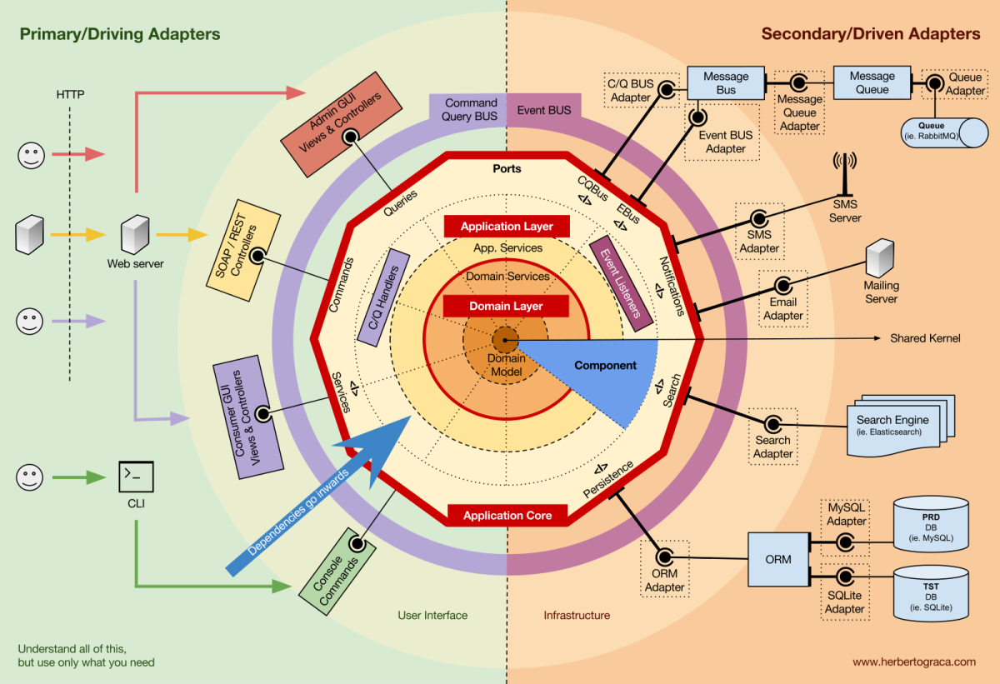

# Hexagonal Architecture (Kiến trúc Lục giác)

## 1. Định nghĩa

**Hexagonal Architecture** là một mô hình thiết kế phần mềm được đề xuất bởi **Alistair Cockburn** nhằm tách biệt **core business logic** (logic nghiệp vụ cốt lõi) khỏi các phần phụ thuộc bên ngoài như:

- Database
- UI
- Message queues
- API / REST
- Frameworks, libraries...

Tên gọi "lục giác" chỉ là biểu tượng hình học, nhưng ý tưởng chính là: **mọi tương tác bên ngoài đều được kết nối với lõi qua các "cổng" (ports) và "bộ chuyển đổi" (adapters).**



---

## 2. Thành phần chính

### a. Core (Domain / Application logic)

- Là trung tâm hệ thống, chứa business logic thật sự.
- Không phụ thuộc bất kỳ công nghệ nào (framework, thư viện, cơ sở dữ liệu...).

### b. Ports

- Là các interface mô tả **các hành vi mà hệ thống mong đợi** (inbound và outbound).
- Ví dụ: `UserRepository`, `PaymentProcessor`, `OrderInputPort`

### c. Adapters

- Là các implementation cụ thể kết nối thế giới bên ngoài vào core thông qua ports.
- Ví dụ:
  - REST Controller → Input Adapter
  - MySQL Repository → Output Adapter
  - Kafka Consumer/Producer Adapter

---

## 3. Phân loại Port

| Loại Port        | Mô tả |
|------------------|-------|
| Inbound Ports    | Cổng đầu vào – tương tác từ bên ngoài vào core (UI, API, CLI) |
| Outbound Ports   | Cổng đầu ra – core yêu cầu thực hiện hành vi bên ngoài (DB, email, queue) |

---

## 4. Lợi ích của Hexagonal Architecture

- **Tách biệt rõ ràng** giữa logic nghiệp vụ và hạ tầng
- **Dễ test** core mà không cần phụ thuộc công nghệ
- **Thay đổi adapter không ảnh hưởng domain**
- **Dễ mở rộng**: thêm REST, gRPC, CLI mà không thay đổi core

---

## 5. Sơ đồ tổng quan

```pgsql
     +--------------------------+
     |      Input Adapters      |  ← REST, CLI, Web
     +-----------+--------------+
                 ↓
          +-------------+
          |   Inbound   | ← Interface (port)
          |   Ports     |
          +------+------+
                 ↓
       +------------------+
       |     Application   |
       |    (Use Cases)    |
       +------------------+
                 ↓
          +-------------+
          |  Outbound   | ← Interface (port)
          |   Ports     |
          +------+------+
                 ↓
     +--------------------------+
     |     Output Adapters      | ← DB, Email, Kafka
     +--------------------------+
```


---

## 6. So sánh với kiến trúc truyền thống (Layered Architecture)

| Layered Architecture         | Hexagonal Architecture           |
|-----------------------------|----------------------------------|
| Tầng Controller → Service → Repository | Các adapter kết nối qua port |
| Gắn chặt với framework      | Tách core ra khỏi framework     |
| Phụ thuộc 1 chiều            | Phụ thuộc vào interface         |

---

## 7. Khi nào nên dùng?

- Dự án có logic nghiệp vụ phức tạp, cần test độc lập với hạ tầng
- Dự án cần dễ dàng thay đổi adapter (DB, API, UI...)
- Xây dựng ứng dụng lâu dài, dễ maintain, dễ mở rộng

---

## 8. Các công nghệ phù hợp

- Java/Spring Boot (với interface, annotation @Component dễ define adapter)
- Node.js (với dependency injection bằng module)
- Python (sử dụng abstract class + DI frameworks)
- Go (interface + adapter pattern)

---

## 9. Kết luận

Hexagonal Architecture giúp xây dựng hệ thống:
- Dễ kiểm thử (testable)
- Dễ bảo trì (maintainable)
- Không phụ thuộc framework cụ thể
- Linh hoạt trong việc thay đổi adapter / công nghệ

