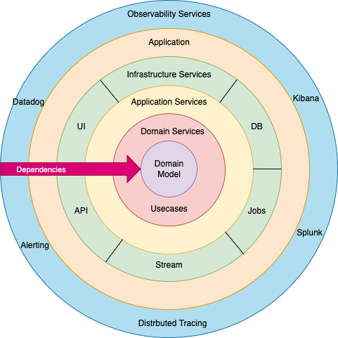

# Onion Architecture (Kiến trúc Củ Hành)

## 1. Định nghĩa

**Onion Architecture** là một kiến trúc phần mềm được giới thiệu bởi **Jeffrey Palermo**, hướng đến:

* Tách biệt business logic khỏi các thành phần phụ thuộc (UI, DB, framework)
* Dễ test, dễ thay đổi các adapter
* Giữ vững Domain Model là trung tâm



---

## 2. Cấu trúc các lớp đồng tâm (Onion Layers)

Từ ngoài vào trong:

```
+---------------------------------------------------------+
|          External Layer (UI, API, DB, Infra...)         |
+---------------------------------------------------------+
|        Application Services (Orchestration logic)       |
+---------------------------------------------------------+
|          Domain Services / Interfaces / Contracts       |
+---------------------------------------------------------+
|                  Domain Model (Entities)                |
+---------------------------------------------------------+
```

### Giải thích:

* **Domain Model**: Entity, Value Object, Rule nghệ nghiệp bền vững
* **Domain Services / Contracts**: Giao diện repository, gateway (interface)
* **Application Services**: Thực thi UseCase, orchestration
* **External Layer**: DB, Web, Message Queue, External API, UI...

---

## 3. Quy tắc phụ thuộc (Dependency Rule)

* Tất cả các phụ thuộc hướng từ ngoài vào trong
* Domain **không biết gì** về UI, DB, framework

---

## 4. Lợi ích

* Tách biệt nghiệp vụ khỏi hạ tầng
* Dễ test UseCase, Entity
* Dễ thay đổi DB / Web / Tool mà không ảnh hưởng logic core

---

## 5. So sánh với Clean Architecture

| Tiêu chí           | Onion Architecture | Clean Architecture          |
| ------------------ | ------------------ | --------------------------- |
| Cấu trúc hình      | Vòng tròn đồng tâm | Vòng tròn đồng tâm          |
| Tách UseCase riêng | Ít rõ ràng         | Rõ ràng riêng UseCase       |
| Lãi cố Entities    | Entity trong core  | Entity + UseCase trong core |
| Phổ biến           | Trung bình         | Cao (chuẩn DDD)             |

---

## 6. Khi nào dùng Onion?

* Dự án Domain-Driven, nghiệp vụ phức tạp
* Cần tách rời logic khỏi hạ tầng
* Cần test độc lập UseCase, Entities

---

## 7. Kết luận

* Onion Architecture là hình thức được nhiều người xem là tiền thân của Clean Architecture
* Giúp bảo vệ Domain Logic, dễ test, dễ thay thế adapter

